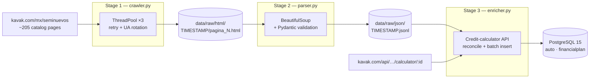

# kavak-scraper

A three-stage ETL pipeline that builds a historical dataset of used-car prices and financing terms from Kavak México's public catalog — concurrent crawler → validated parser → API enricher, landing in PostgreSQL.

## The problem

Mexico's used-car market has no public, structured source for pricing, mileage, or financing data. Kavak's catalog is the largest single inventory, but it is a moving target: the same unit can change price between days, get reserved, or disappear entirely, and credit-plan terms are only exposed through a per-vehicle calculator API. Building a historical series requires repeated capture that survives network failures, rate limiting, and layout changes — and re-runs that don't corrupt what was already recorded.


## What it does

- **Concurrent HTML crawling** — `ThreadPoolExecutor` with per-thread `requests.Session` (via `threading.local()`), retry with exponential backoff on 429/5xx (`urllib3.Retry`), rotating User-Agents, and jittered delays between requests ([src/crawler.py](src/crawler.py)).
- **Resumable downloads** — each run writes to a timestamped folder and skips pages already on disk, so an interrupted crawl continues where it stopped (`process_page_workflow`).
- **Validated parsing** — BeautifulSoup extracts price, mileage, city, and reservation/discount banners from each listing card; every record passes through a Pydantic schema (`Autokavak`, [src/schemas.py](src/schemas.py)) before it is written to JSONL, with in-run deduplication by car ID ([src/parser.py](src/parser.py)).
- **Financial enrichment** — for each car, the enricher calls Kavak's credit-calculator API and extracts every available payment plan: term, monthly payment, interest rate, insurance, and down-payment bounds ([src/enricher.py](src/enricher.py)).
- **Idempotent persistence** — cars are upserted by ID (`reconcile_auto_state`), and financial plans are keyed by `(id_auto, fecha_captura)`: re-running the enricher on the same day never duplicates a capture.
- **Batched writes** — records accumulate in a buffer and flush to PostgreSQL in batches of `BATCH_SIZE` instead of one commit per row.
- **Centralized file logging** — every module logs through one configuration ([src/logger.py](src/logger.py)); `print()` does not appear in the codebase.

## Architecture



Each stage persists its output before the next stage begins. Raw HTML is kept on disk so parser bugs can be fixed and re-run without re-crawling; JSONL is kept so the enricher can be re-run (or rate-limited and resumed) without re-parsing. Network failures, parsing failures, and API failures are isolated to their own stage — the same bronze → silver → gold separation used in warehouse pipelines, applied to scraping.

## Design highlights

**Intermediate storage between every stage.** The pipeline never chains extraction and transformation in memory. HTML lands on disk verbatim, parsed records land as JSONL, and only then does enrichment touch the database. The expensive, unrepeatable step (crawling a live catalog at a point in time) is decoupled from the cheap, repeatable ones — a parser regression costs a re-parse, not a lost capture day.

**Validation schema and persistence model are separate classes.** `Autokavak` ([src/schemas.py](src/schemas.py)) is a Pydantic DTO enforcing input rules at the parsing boundary — `price > 0`, `year >= 2000`, `km >= 0`, non-empty ID. `Auto` ([src/models.py](src/models.py)) is the SQLModel table the enricher persists. Scraping rules and storage schema evolve independently; a change to what Kavak renders doesn't ripple into the database layer.

**Idempotent re-runs keyed on `(id_auto, fecha_captura)`.** Before calling the API for a car, the enricher checks whether a `FinancialPlan` already exists for that car today ([src/enricher.py](src/enricher.py)). A crashed or repeated run resumes past already-captured cars without duplicating plans and without a state file — the database itself is the high-water mark.

**State reconciliation instead of blind insert.** `reconcile_auto_state` fetches the existing `Auto` row and overwrites only the volatile fields — price, mileage, discount flag — while keeping the identity row stable (SCD Type 1 on the car, while `FinancialPlan` rows accumulate as the historical series). The car table answers "what is this unit now"; the plans table answers "what were the terms on each capture date".

**Deliberate network posture per stage.** The crawler isolates one `requests.Session` per thread with `threading.local()` and delegates retry to `urllib3.Retry` (exponential backoff on 429/500/502/503/504). The enricher, which hits an API rather than static pages, instead recycles its session every 50 requests (`get_fresh_session`) to shed accumulated cookies and adds randomized 1.5–4 s delays — two different anti-rate-limiting strategies matched to two different endpoints.

## Tech stack

Python 3.12 · PostgreSQL 15 · SQLModel / SQLAlchemy · Pydantic · BeautifulSoup 4 · requests · Docker Compose · uv

## Getting started

Requirements: Python 3.12+, Docker, [`uv`](https://docs.astral.sh/uv/).

```bash
git clone <repo-url>
cd kavak-scraper
uv sync
```

Create a `.env` file at the project root:

```env
POSTGRES_USER=kavak
POSTGRES_PASSWORD=your_password
POSTGRES_DB=kavak_oltp
POSTGRES_HOST=localhost
POSTGRES_PORT=5432
```

Then run the three stages in order — each one reads the latest output of the previous:

```bash
docker compose up -d           # 1. PostgreSQL warehouse
uv run python -m src.crawler   # 2. Download catalog pages → data/raw/html/
uv run python -m src.parser    # 3. Parse latest HTML → data/raw/json/*.jsonl
uv run python -m src.enricher  # 4. Enrich latest JSONL via API → PostgreSQL
```

Tables are created automatically on the enricher's first run. Logs are written to `logs/kavak_pipeline_<date>.log`.

## Limitations and future work

This is a personal batch pipeline for market analysis, not a production service with an SLA. Stages are launched manually and scheduling is up to the operator. Natural extensions:

- **Orchestration** — the stages are already independent modules with file/database handoffs, which maps directly onto an Airflow DAG (one task per stage).
- **Retry on the enrichment API** — the crawler retries with backoff; the enricher currently logs and skips a failed API call. Wrapping it with the same `Retry` policy is the next resilience step.
- **Tests** — parsing and reconciliation logic are pure functions and straightforward to cover; no test suite exists yet.
- **Monitoring** — logs are file-based; there are no metrics on capture completeness per run.
